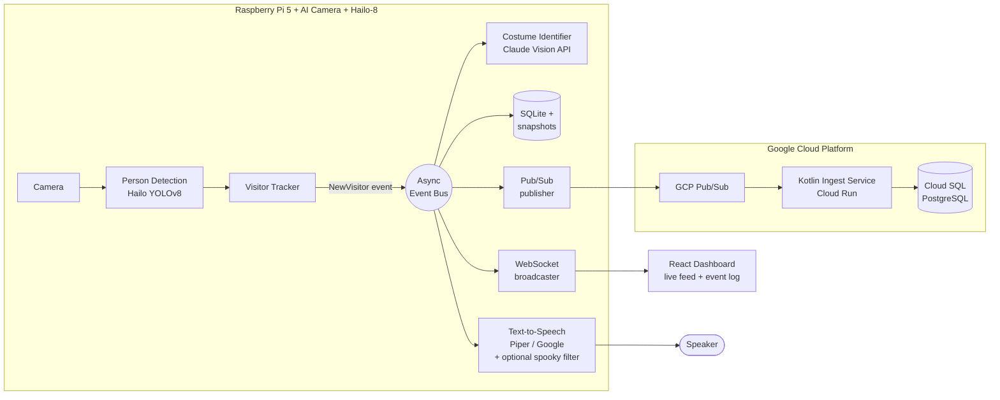

# 🎃 Costume Spotter

**An edge-AI system that spots people in costumes, identifies what they're wearing,
cracks a joke about it out loud, and logs every sighting — running on a Raspberry Pi 5
with a cloud tier on Google Cloud Platform.**

> Point it at your front porch on Halloween. When a T-Rex walks up, the speaker says
> *"A wild T-Rex appears — those tiny arms won't hold much candy!"*, the sighting lands
> in a database, and the live dashboard shows the moment it happened.

This repository is a **portfolio project**: it is deliberately built to demonstrate
end-to-end engineering across embedded AI, event-driven backend design, modern
frontend work, and cloud infrastructure. Every significant decision is documented
with its trade-offs in an [Architecture Decision Record](docs/decisions/).

---

## What it does

1. **Watches** a live camera feed from a Raspberry Pi AI Camera.
2. **Detects** people in real time using the Hailo-8 AI accelerator (26 TOPS) — no cloud needed for detection.
3. **Tracks** each person so one visitor produces one event, not thirty per second.
4. **Identifies** the costume by sending the visitor's best few snapshots to the Claude
   Vision API — along with the costumes already seen tonight, so repeats get fresh jokes —
   which returns a costume label, a confidence score, and a witty one-liner in one structured call.
5. **Speaks** the one-liner through a speaker (local Piper TTS by default, Google Cloud TTS
   optional), with an optional rotating **spooky voice** effect for Halloween.
6. **Logs** every sighting to SQLite on the device, with a cropped snapshot.
7. **Streams** the live feed, detection boxes, and a real-time event log to a React dashboard.
8. **Publishes** (optionally) each sighting to GCP Pub/Sub, where a Kotlin service on
   Cloud Run writes it to Cloud SQL for durable, queryable history.

## System at a glance



Full architecture with sequence diagrams and decision flowcharts: **[docs/architecture.md](docs/architecture.md)**

## Repository map

| Directory | What lives here | Stack |
|-----------|-----------------|-------|
| [`edge/`](edge/) | The application that runs on the Pi: detection, tracking, event bus, AI calls, TTS, storage, API | Python 3.11+, FastAPI, SQLAlchemy |
| [`web/`](web/) | Live dashboard: camera feed, detection overlay, event log, sighting history & stats | React, TypeScript, Vite, Tailwind |
| [`cloud/ingest-service/`](cloud/ingest-service/) | Receives sightings from Pub/Sub, persists to Cloud SQL | Kotlin, Ktor, Flyway |
| [`cloud/terraform/`](cloud/terraform/) | All GCP infrastructure as code | Terraform |
| [`docs/`](docs/) | Architecture, requirements, decision records, setup runbooks | Markdown + Mermaid |

## Documentation

**Start here:** [docs/architecture.md](docs/architecture.md) — the system overview with diagrams.

- **Requirements** (functional + non-functional, per component): [docs/requirements/](docs/requirements/)
- **Decision records** (why each technology was chosen, with pros/cons): [docs/decisions/](docs/decisions/)
- **Setup guides:**
  - [Run everything on a laptop — no Pi needed](docs/setup-dev.md) (mock camera & detector)
  - [Raspberry Pi bring-up](docs/setup-pi.md) (Hailo drivers, AI camera, speaker, systemd)
  - [GCP deployment](docs/setup-gcp.md) (Terraform, Cloud Run, Cloud SQL)

## Quick start (no hardware required)

The entire pipeline runs on a laptop using a webcam or sample video in place of the
Pi camera, and a mock detector in place of the Hailo chip — see
[ADR-008](docs/decisions/008-hardware-abstraction.md) for why the code is built this way.

```bash
# Backend (from edge/)
python -m venv .venv && . .venv/bin/activate   # Windows: .venv\Scripts\activate
pip install -e ".[dev]"
copy .env.example .env                          # then add ANTHROPIC_API_KEY (optional in dev)
python -m costume_spotter                       # starts on http://localhost:8000

# Frontend (from web/)
npm install
npm run dev                                     # dashboard on http://localhost:5173
```

Without an API key the identifier runs in "pretend" mode and produces canned
costumes/comments, so the whole event pipeline is still demonstrable offline.

## Hardware

| Part | Role |
|------|------|
| Raspberry Pi 5 (4 GB) | Host: runs the Python app, API server, TTS |
| Raspberry Pi AI Camera (Sony IMX500) | Video source (its on-sensor NPU is a documented alternative detector — [ADR-001](docs/decisions/001-hailo-vs-imx500.md)) |
| Hailo AI HAT+ (26 TOPS, Hailo-8) | Runs YOLOv8 person detection at full frame rate |
| Any USB / I²S speaker | Voice output |

## Privacy

This project films people. The stance (detailed in
[docs/requirements/05-storage.md](docs/requirements/05-storage.md)):
snapshots are stored **only on the device**, auto-pruned after a configurable
retention window, excluded from git, and **never** uploaded to the cloud tier —
only costume labels and timestamps leave the Pi. There is no face recognition
and no identity tracking across visits.

## License

MIT — see [LICENSE](LICENSE).
