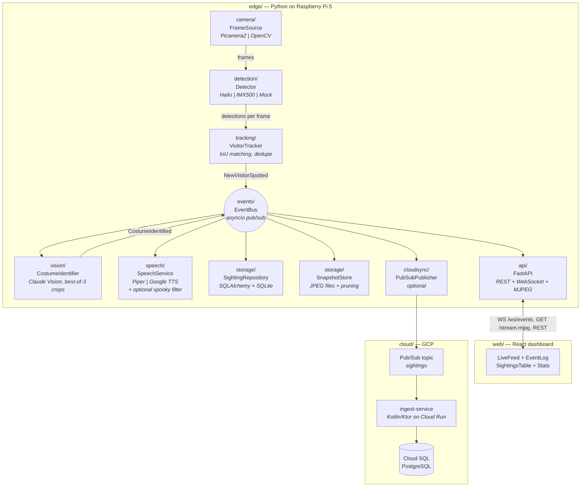
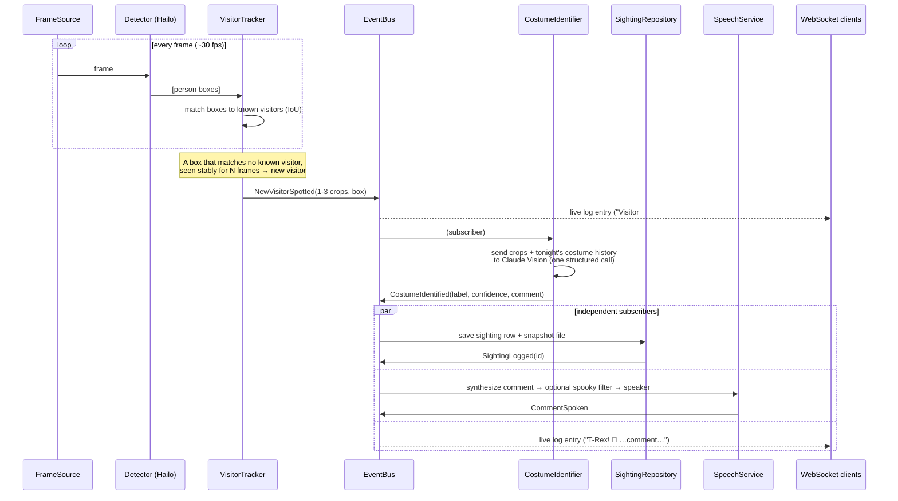
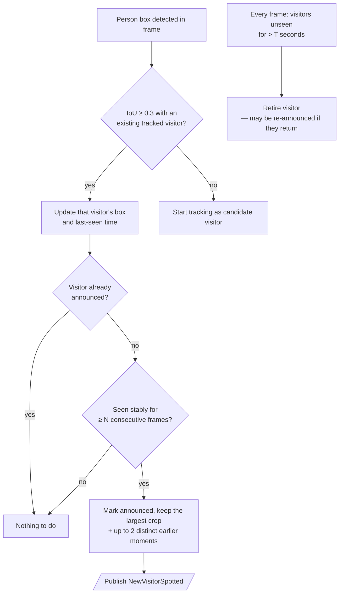
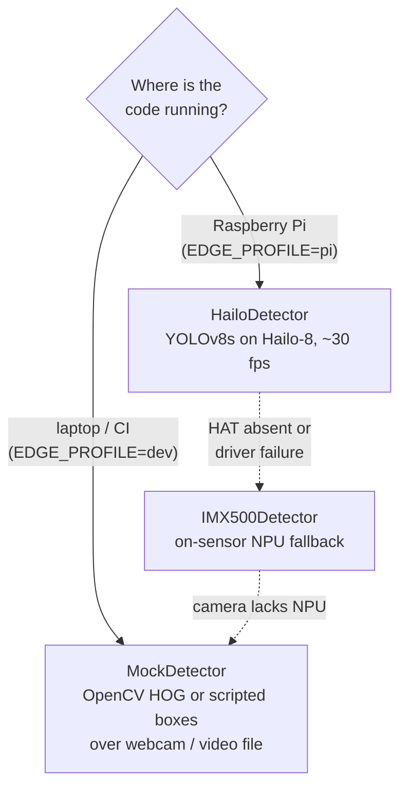
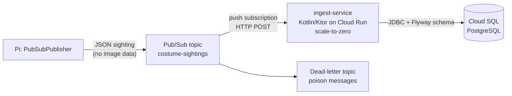

# Architecture

This document is the technical overview of Costume Spotter: the components, how data
flows between them, and where the important design decisions live. Each decision has a
full write-up with pros/cons in [docs/decisions/](decisions/); this page links to them
in context.

## Design principles

1. **Event-driven core.** Detection produces events; everything else (AI identification,
   logging, speech, UI updates, cloud sync) *subscribes* to events. No component calls
   another directly. This is the single most important structural choice — see
   [ADR-003](decisions/003-event-bus.md) for why.
2. **Interfaces at every hardware and vendor boundary.** Camera, detector, TTS engine,
   and audio output are all abstract interfaces with real and mock implementations, so
   the full system runs on a laptop with no Pi attached
   ([ADR-008](decisions/008-hardware-abstraction.md)).
3. **The edge works alone.** The Pi is fully functional with no internet: detection,
   tracking, logging, and (Piper) speech are local. Cloud AI and cloud sync are
   *enhancements* that degrade gracefully.
4. **Readability over cleverness.** Small modules, one responsibility each, comments
   that explain *why*.

## Component diagram

## The life of a sighting

The sequence below is the core loop of the whole system. Note that after the tracker
publishes `NewVisitorSpotted`, every downstream step is an independent subscriber —
if the Claude API is slow, video streaming and logging are unaffected.

## Event catalogue

Events are frozen dataclasses in [`edge/costume_spotter/events/events.py`](../edge/costume_spotter/events/events.py).

| Event | Published by | Consumed by | Payload highlights |
|-------|--------------|-------------|--------------------|
| `FrameProcessed` | pipeline | API (MJPEG/overlay) | annotated frame, boxes, fps |
| `NewVisitorSpotted` | tracker | identifier, API | visitor id, primary snapshot + up to 2 extra crops (JPEG bytes, dropped from the WS wire), box |
| `CostumeIdentified` | identifier | storage, speech, API, cloudsync | costume label, confidence, comment |
| `SightingLogged` | storage | API | sighting DB id, snapshot path |
| `CommentSpoken` | speech | API | text, engine used, duration |
| `SystemStatus` | all | API | component health heartbeats |

## "Is this a new visitor?" decision flow

The tracker is the gatekeeper that turns 30 detections/second into one event per
person. Getting this wrong means either spamming the Claude API (expensive) or missing
visitors. The logic:

The stability window (`N` frames) exists because YOLO occasionally fires on a shadow
for one frame; requiring consecutive hits filters those out. The retirement timeout
(`T`) means someone who leaves and comes back 10 minutes later is greeted again —
acceptable for a porch on Halloween, and much simpler than re-identification
(deliberately out of scope; see README privacy section).

## Which detector runs where

Why Hailo is primary and the IMX500's on-sensor NPU is the fallback: the Hailo-8's 26
TOPS runs larger, more accurate models with headroom to spare, while the IMX500 is
limited to small models but consumes zero host CPU. Full analysis in
[ADR-001](decisions/001-hailo-vs-imx500.md).

Frames are **letterboxed** into the model's square input — scaled preserving aspect
ratio and padded — rather than squished, and result boxes are mapped back through the
same geometry. Squishing a 16:9 frame distorts people ~33% horizontally and measurably
hurts recall on wide/bulky costumes, exactly the visitors this project most wants to
catch. The geometry is pure, unit-tested functions in
[`detection/hailo.py`](../edge/costume_spotter/detection/hailo.py).

## Resilience choices (for an unattended appliance)

This runs on a porch through power cuts, so several deliberate choices favor
self-healing and loud failure over silent breakage:

- **The frame pipeline shouts when it dies.** It's a fire-and-forget asyncio task;
  its exceptions are caught, logged with a full traceback, and flip the
  camera/detector health to red — rather than being silently discarded while the API
  keeps serving a frozen feed.
- **The camera self-heals a boot race.** The AI Camera's on-board RP2040 can be slow
  to initialize at cold boot, leaving the `imx500` driver unbound; the systemd unit's
  [`ensure-camera.sh`](../edge/deploy/ensure-camera.sh) reloads the module before the
  app starts (see [setup-pi.md](setup-pi.md) troubleshooting).
- **The AI never blocks the show.** Missing/invalid API key fails fast at startup with
  an actionable message; API failure at runtime falls back to a canned greeting; a
  missing `sox` degrades the spooky voice to normal audio. The porch keeps talking.

## The edge API surface

FastAPI serves both the React app (static, in production) and these endpoints:

| Endpoint | Kind | Purpose |
|----------|------|---------|
| `GET /api/sightings` | REST | Paginated sighting history (label, comment, time, snapshot URL) |
| `GET /api/sightings/{id}/snapshot` | REST | Snapshot JPEG for one sighting |
| `GET /api/stats` | REST | Counts by costume, sightings per hour, uptime |
| `GET /api/health` | REST | Component heartbeats (camera, detector, identifier, speech) |
| `WS /ws/events` | WebSocket | Every bus event, JSON-serialized, for the live log + box overlay |
| `GET /stream.mjpg` | MJPEG | Live camera feed (multipart JPEG — [ADR-007](decisions/007-mjpeg-vs-webrtc.md)) |

## Cloud tier

The cloud tier is intentionally a separate, minimal, independently deployable system —
the Pi never blocks on it.

Design notes:

- **Push, not pull.** Cloud Run scales to zero; a push subscription wakes it only when
  a sighting arrives. Pull would require an always-on subscriber (idle cost).
- **At-least-once delivery** means the ingest service must be idempotent: the edge
  generates a UUID per sighting and the Postgres table has a unique constraint on it;
  duplicates are acknowledged but not re-inserted.
- **No images leave the Pi.** The published message carries label/confidence/comment/
  timestamp only (privacy requirement — [05-storage.md](requirements/05-storage.md)).
- Postgres over Firestore/BigQuery: [ADR-006](decisions/006-cloud-sql.md).

## Technology summary

| Concern | Choice | Decision record |
|---------|--------|-----------------|
| Person detection | YOLOv8s on Hailo-8, letterboxed input | [ADR-001](decisions/001-hailo-vs-imx500.md) |
| Costume ID + comment | Claude Vision API (structured output, best-of-3 crops + costume history) | [ADR-002](decisions/002-claude-vision.md) |
| Component decoupling | In-process asyncio event bus | [ADR-003](decisions/003-event-bus.md) |
| Edge persistence | SQLite via SQLAlchemy | [ADR-004](decisions/004-sqlite-edge.md) |
| Text-to-speech | Strategy pattern: Piper (default) / Google Cloud TTS | [ADR-005](decisions/005-tts-strategy.md) |
| Spooky voice (optional) | Rotating `sox` audio filter, WAV→WAV, graceful skip | [04-speech.md](requirements/04-speech.md) (04-F8) |
| Cloud database | Cloud SQL (PostgreSQL) | [ADR-006](decisions/006-cloud-sql.md) |
| Live video to browser | MJPEG over HTTP | [ADR-007](decisions/007-mjpeg-vs-webrtc.md) |
| Testability without hardware | Ports & adapters (mock camera/detector/audio) | [ADR-008](decisions/008-hardware-abstraction.md) |
| Cloud ingest language | Kotlin + Ktor on Cloud Run | [ADR-009](decisions/009-kotlin-ingest.md) |
